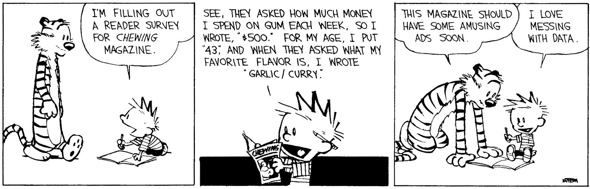

```{r setup, include=FALSE}
knitr::opts_chunk$set(echo = TRUE, fig.width = 9, fig.height = 6, dpi = 300)

library(tidyverse)
theme_set(theme_bw())
```

class: inverse,middle,center
# Randomness, Models, and Errors

```{r, echo = F}
olympic100m <- read_csv("materials/labs/linear_regression/data100m.csv", col_names = c("year", "time"), col_types = "dd") %>%
  mutate(type = "data")
model <- lm(time ~ year, data = olympic100m)
pred <- tibble(year = seq(1895, 2015, .5)) %>%
  mutate(time = predict(model, newdata = .),
         type = "prediction") %>%
  bind_rows(olympic100m) %>%
  arrange(year) %>%
  spread(key = type, value = time) %>%
  mutate(error = data - prediction)
```

---
class: middle,center
### In the beginning, there was the data...

---

```{r init-olympic, echo = F}
ggplot(olympic100m, aes(x = year, y = time)) + 
  geom_point() + 
  xlim(c(1895, 2015)) + 
  xlab("Year") + ylab("Time (s)") + ggtitle("Winning Olympic men's 100m times")
```
--
and the statistician said "Let there be a model". 

---

```{r init-olympic-lm, echo = F, warning = F}
ggplot(pred, aes(x = year)) + 
  geom_point(aes(y = data)) + 
  geom_line(aes(y = prediction), linetype = "dashed") + 
  xlim(c(1895, 2015)) + 
  xlab("Year") + ylab("Time (s)") + ggtitle("Winning Olympic men's 100m times")
```

And we fit a linear model. 

---

```{r init-olympic-errors, echo = F, warning = F}
ggplot(pred, aes(x = year)) + 
  geom_point(aes(y = data)) + 
  geom_line(aes(y = prediction), linetype = "dashed") + 
  xlim(c(1895, 2015)) + 
  geom_segment(aes(x = year, xend = year, y = data, yend = prediction), color = "red") + 
  xlab("Year") + ylab("Time (s)") + ggtitle("Winning Olympic men's 100m times")
```

The model separated the data into predictions and errors, 

---

```{r init-olympic-known-unknown, echo = F, warning = F}
pred2 <- pred %>%
  select(year, data = data, prediction, error = error) %>%
  filter(!is.na(data)) %>%
  gather(key = "variation", value = "value", -data, -year) %>%
  mutate(variation = factor(variation, c("prediction", "error")),
         endpoint = ifelse(variation == "prediction", min(data), 0))
  
ggplot(pred2, aes(x = year, y = value, xend = year, yend = endpoint)) + 
  geom_point() + 
  geom_segment(aes(color = variation)) + 
  facet_grid(variation~., space = "free_y", scales = "free") +  
  scale_color_manual("Variation", values = c("error" = "red", "prediction" = "blue"), guide = F) + 
  xlim(c(1895, 2015)) + 
  xlab("Year") + 
  scale_y_continuous("Time (s)", breaks = seq(-0.5, 12, 0.5)) + 
  ggtitle("Winning Olympic men's 100m times")
```

or "known" and "unknown" sources of variation. 
---
class: middle,center

The statistician called the "unknown" variation __random error__,    
but s/he did not rest. 
<br/><br/><br/>
--
[Variance Decomposition Derivation](https://en.wikipedia.org/wiki/Variance#Decomposition)


---
## Randomness and Error

Linear regression model form: $$y = w_0 + w_1 x$$

--

This model is __deterministic__ - you will always get the same $y$ value when you have multiple observations at the same $x$

<br/><br/>

--

Probabilistic version: $$y = w_0 + w_1 x + \epsilon$$

$\epsilon$ represents "random error"

A __random variable__ is a variable that can take on many values with different probabilities. $x$, $y$, and $\epsilon$ are random variables. 

---
## Sources of Error

- measurement
- environmental
- human
- modeling

We group all of these into "random error" and model it with $\epsilon$. 



---
## Random Variables

Random variables have a __distribution__ of potential values.

```{r, fig.width = 8, fig.height = 4, echo = F, message = F, warning = F}
x <- rnorm(200)
normaldf <- tibble(x = seq(-4, 4, .01), y = dnorm(x))

p1 <- ggplot() + 
  geom_histogram(aes(x = x, y = ..density..), fill = "grey", color = "black") + 
  geom_line(aes(x = x, y = y), data = normaldf) + 
  ggtitle("Continuous Distribution")

x2 <- rpois(200, lambda = 1)
poisdf <- tibble(x = seq(0, 10, 1), theoretical = dpois(x, 1), 
                 actual = purrr::map_dbl(x, ~sum(x2 == .)/length(x2))) #%>%
  #tidyr::gather(key = "type", value = "prob", -x)


p2 <- ggplot(data = poisdf) + 
  geom_bar(aes(x = x, y = actual), color = "black", fill = "grey", stat = "identity") + 
  geom_point(aes(x = x, y = theoretical)) + 
  scale_x_continuous(breaks = 1:10) + 
  ylab("prob") + 
  ggtitle("Discrete Distribution")

gridExtra::grid.arrange(p1, p2, ncol = 2)
```

---
## Statistical Modeling

We usually assume that errors are

- independent (of other errors)

- identically distributed (all errors come from the same distribution)

- (sometimes) errors come from a specific distribution

--

... that's where the trouble starts...

---
## Statistical Modeling

Most of the trouble in modeling and prediction comes from three places:

- non-independent errors    
e.g. relationships between points within the data set

- non identical errors    
e.g. systematic variation not accounted for by the model

- mismatches between model assumptions and the distribution of the errors

---
class: middle, center, inverse
# Visual Diagnostics for Models


---
## Visual Diagnostics for Models

For some model $$y = f(\vec{x}) + \epsilon$$

- How do we examine our errors for problems?

- How do we determine what model (of several) fits the data best?

---

## Exploratory Data Analysis

Before you start modeling

- Plot $y$ against any explanatory variables $x_1, ..., x_n$

- Plot the distribution of $y$, the distribution of $x_1, ..., x_n$ to look for unexpected features

- Plot the relationship between different $x_i$'s

???

Visualization is an art as well as a science, and requires thinking critically about your data while being open to finding new things.

---

## United Nations Human Development Data


The United Nations maintains a dataset with quality-of-life indicators for most countries in the world. You can explore the data [here](http://hdr.undp.org/en/data). 

There is also a "World Happiness Index" ([link](https://countryeconomy.com/demography/world-happiness-index))

Let's predict happiness based on factors in the UN Quality of Life dataset

```{r, message=F}
library(tidyverse)
# csv url: https://raw.githubusercontent.com/srvanderplas/
#          miscTeaching/master/ds303_2019/2017_Human_Dev_Index.csv

hdi_2017 <- read_csv("https://bit.ly/2mbYdfX")

hdi_2017
```

---
## Exploratory Data Analysis

What variables might be relevant to the Happiness Index on a national scale?

```{r, fig.width = 6, fig.height = 3, message = F, warning = F}
ggplot(hdi_2017) + 
  geom_point(aes(x = GDP, y = Happiness_Index))
```


---
## Exploratory Data Analysis

What variables might be relevant to the Happiness Index on a national scale?

```{r, fig.width = 6, fig.height = 3, message = F, warning = F}
ggplot(hdi_2017) + 
  geom_point(aes(x = GDP, y = Happiness_Index)) + 
  xlim(c(0, 2500))
```

---
## Exploratory Data Analysis

```{r, fig.width = 6, fig.height = 3, message = F, warning = F}
ggplot(hdi_2017) + 
  geom_point(aes(x = GDP, y = Happiness_Index)) + 
  scale_x_log10()
```
$\log_{10}(GDP)$

---
## Exploratory Data Analysis

```{r, fig.width = 6, fig.height = 3, message = F, warning = F}

ggplot(hdi_2017) + 
  geom_point(aes(x = Gross_National_Income, y = Happiness_Index))

```

Might not be linearly related, but definitely related...

---
## Exploratory Data Analysis

```{r, fig.width = 6, fig.height = 3, message = F, warning = F}
ggplot(hdi_2017) + 
  geom_point(aes(x = Life_Exp_Birth, y = Happiness_Index))

```

Again, possible nonlinearity, but definitely related

---
## Exploratory Data Analysis

```{r, fig.width = 6, fig.height = 3, message = F, warning = F}
ggplot(hdi_2017) + 
  geom_point(aes(x = Parlaiment_Pct_Female, y = Happiness_Index))
```

---
## Exploratory Data Analysis

```{r, fig.width = 6, fig.height = 3, message = F, warning = F}
ggplot(hdi_2017) + 
  geom_point(aes(x = Teen_Birth_Rate, y = Happiness_Index))

```
---
## Exploratory Data Analysis

```{r, fig.width = 6, fig.height = 3, message = F, warning = F}
ggplot(hdi_2017) + 
  geom_point(aes(x = Ineq_education, y = Happiness_Index))
```
Inequality in Education(%) : Inequality in distribution of years of schooling based on data from household surveys... [Source](http://hdr.undp.org/en/composite/IHDI#a)

---
## Exploratory Data Analysis

```{r, fig.width = 6, fig.height = 3, message = F, warning = F}
ggplot(hdi_2017) + 
  geom_point(aes(x = Ineq_income, y = Happiness_Index))
```

---
## Exploratory Data Analysis

```{r, fig.width = 6, fig.height = 3, message = F, warning = F}
ggplot(hdi_2017) + 
  geom_point(aes(x = Ineq_Life_Exp, y = Happiness_Index))
```

---
## Exploratory Data Analysis

```{r, eval = F}
model_data <- select(hdi_2017, Country, Happiness_Index, 
                     Ineq_education, Ineq_income, Ineq_Life_Exp, 
                     Teen_Birth_Rate, Life_Exp_Birth, 
                     GDP, Gross_National_Income) %>%
  mutate(log10GDP = log10(GDP)) %>%
  select(-GDP)

install.packages("GGally")
library(GGally)
ggscatmat(data = model_data[, -c(1:2)]) 
# Scatterplot Matrix - see all of the independent variables and how they relate
# to each other

```


---
## Exploratory Data Analysis

```{r, echo = F, fig.width = 10, fig.height = 10, out.width = "60%", message = F, warning = F}
model_data <- select(hdi_2017, Country, Happiness_Index, 
                     Ineq_education, Ineq_income, Ineq_Life_Exp, 
                     Teen_Birth_Rate, Life_Exp_Birth, 
                     GDP, Gross_National_Income) %>%
  mutate(log10GDP = log10(GDP)) %>%
  select(-GDP)

GGally::ggscatmat(data = model_data[, -c(1:2)]) 

```

