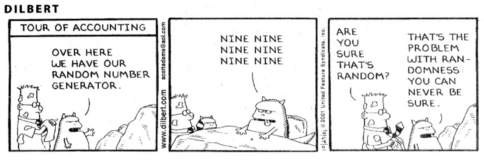

```{r setup, include=FALSE}
knitr::opts_chunk$set(echo = TRUE)

library(tidyverse)
theme_set(theme_bw())
```

## Randomness, Models, and Errors

```{r, echo = F}
olympic100m <- read_csv("materials/labs/linear_regression/data100m.csv", col_names = c("year", "time"), col_types = "dd") %>%
  mutate(type = "data")
model <- lm(time ~ year, data = olympic100m)
pred <- tibble(year = seq(1895, 2015, .5)) %>%
  mutate(time = predict(model, newdata = .),
         type = "prediction") %>%
  bind_rows(olympic100m) %>%
  arrange(year) %>%
  spread(key = type, value = time) %>%
  mutate(error = data - prediction)
```

In the beginning, there was the data...

```{r init-olympic, echo = F}
ggplot(olympic100m, aes(x = year, y = time, xend = year, yend = 0)) + 
  geom_point() + 
  geom_segment() + 
  xlim(c(1895, 2015)) + 
  xlab("Year") + ylab("Time (s)") + ggtitle("Winning Olympic men's 100m times", subtitle = " ")
```

and then the statistician said "Let there be a model". And we fit a linear model. 

```{r init-olympic-lm, echo = F, warning = F}
ggplot(pred, aes(x = year)) + 
  geom_point(aes(y = data)) + 
  geom_line(aes(y = prediction), linetype = "dashed") + 
  xlim(c(1895, 2015)) + 
  xlab("Year") + ylab("Time (s)") + ggtitle("Winning Olympic men's 100m times")
```

The model separated the data into predictions and errors, or "known" and "unknown" sources of variation. 

```{r init-olympic-errors, echo = F, warning = F}
ggplot(pred, aes(x = year)) + 
  geom_point(aes(y = data)) + 
  geom_line(aes(y = prediction), linetype = "dashed") + 
  xlim(c(1895, 2015)) + 
  geom_segment(aes(x = year, xend = year, y = data, yend = prediction), color = "red") + 
  xlab("Year") + ylab("Time (s)") + ggtitle("Winning Olympic men's 100m times")
```


```{r init-olympic-known-unknown, echo = F, warning = F}
pred2 <- pred %>%
  select(year, data = data, prediction, error = error) %>%
  filter(!is.na(data)) %>%
  gather(key = "variation", value = "value", -data, -year) %>%
  mutate(variation = factor(variation, c("prediction", "error")),
         endpoint = ifelse(variation == "prediction", min(data), 0))
  
ggplot(pred2, aes(x = year, y = value, xend = year, yend = endpoint)) + 
  geom_point() + 
  geom_segment(aes(color = variation)) + 
  facet_grid(variation~., space = "free_y", scales = "free") +  
  scale_color_manual("Variation", values = c("error" = "red", "prediction" = "blue"), guide = F) + 
  xlim(c(1895, 2015)) + 
  xlab("Year") + 
  scale_y_continuous("Time (s)", breaks = seq(-0.5, 12, 0.5)) + 
  ggtitle("Winning Olympic men's 100m times")
```

The statistician called the "unknown" variation "random error", but s/he did not rest. 

[Variance Decomposition Math](https://en.wikipedia.org/wiki/Variance#Decomposition)

----------------------------------------


The least-squares method for linear regression only assumes the form of the relationship between y and x; it does not make any statements about errors or probability, because it is a deterministic model. $$y = w_0 + w_1 x$$

Deterministic models assume that you will always get the same value when you take repeated measurements of something under the same conditions. Sometimes that may be true, for highly controlled situations, but generally, the results of repeated measurements aren't always identical. A model which accounts for these fluctuations is a probabilistic model - it includes the concept of "random error". $$y = w_0 + w_1 x + \epsilon$$

Statistical models are probabilistic: they account for errors and propagate the errors through the modeling process. To do this, models usually involve making some assumptions about the distribution of the errors. 

Typically, we like to say something like "We assume $\epsilon \overset{iid}{\sim} N(0, \sigma^2)$". That translates to assuming the errors are independent and identically distributed (iid) and follow a Normal distribution with mean 0 and variance $\sigma^2$.

There are  many different ways to violate each of the 3 assumptions in the statement above; violations of the assumptions of a particular statistical model may impact the validity of predictions made using that model or any quantification of uncertainty in predictions or parameter estimates. 

------------------------

Some sources of error: 

- measurement error - miscalibrated or malfunctioning instruments
- environmental error - fluctuations in external factors that affect the observed factor during data collection. The data was collected correctly, but conditions weren't the same for every data point.
- human error - incorrect collection of data, typos, reaction time, ...

We usually group these errors into "random error", and model $y$, $x$, and $\epsilon$ as __random variables__ - quantites which represent the unknown, unpredictable occurrences of the physical system under observation as well as the data collection process. 

Note that there are also non-random errors - systematic biases within the data collection process. These can be difficult to distinguish from random errors, because randomness is sometimes hard to quantify. 



Random variables have a __distribution__ of potential values that they take probabilistically. Ideally, we'd like our errors to have the same distribution, and we'd like them to not be systematically related to each other, because then we can treat them as a single unit... what we like to call __iid__, or independent and identically distributed. 


Most of the trouble in modeling and prediction comes from three places:

- non-independent errors (relationships between points within the data set)
- non identical errors (systematic variation not accounted for by the model)
- mismatches between model assumptions and the distribution of the errors

---------------------------------------------------------------------------------

## Visual Diagnostics for Models

How do we examine our model errors for problems?

How do we determine what model fits the data best?

--------------------------------------------------------------------------------

Start with EDA: Exploratory Data Analysis

- Plot the explanatory variables against the response variable

- Plot the distribution of each of the variables - look for unexpected features

- Plot the relationship between explanatory variables

Visualization is an art, as well as a science. It requires thinking critically about your data, but also being open to seeing things you didn't expect to see. 

### United Nations Human Development Data

The United Nations maintains a dataset with quality-of-life indicators for most countries in the world. You can explore the data [here](http://hdr.undp.org/en/data). 

```{r}
library(tidyverse)

hdi_2017 <- read_csv("2017_Human_Dev_Index.csv") %>%
  rename("GDP_total" = "Gross domestic product, total (2011 PPP $ billions)",
         "GNI_per_capita" = "Gross national income per capita (2011 PPP $)", 
         "HDI" = "Human Development Index",
         "Infants_not_immunized_measles" = "Infants lacking immunization, measles (% of one-year-olds)", 
         "Adolescent birth rate" = "Adolescent birth rate (births per 1,000 women ages 15-19)") %>%
  select(year, -country_code, Country = country_name, HDI, GDP_total, GNI_per_capita, everything())

```

```{r, fig.width = 4, fig.height = 4, out.width = "24%", fig.keep='all', fig.show='hold'}

ggplot(hdi_2017) + 
  geom_point(aes(x = GDP_total, y = HDI)) # highly skewed

ggplot(hdi_2017) + 
  geom_point(aes(x = log10(GDP_total), y = HDI))

ggplot(hdi_2017) + 
  geom_point(aes(x = GNI_per_capita, y = HDI))

ggplot(hdi_2017) + 
  geom_point(aes(x = Infants_not_immunized_measles, y = HDI))

ggplot(hdi_2017) + 
  geom_point(aes(x = `Mean years of schooling`, y = HDI))

ggplot(hdi_2017) + 
  geom_point(aes(x = `Life expectancy at birth`, y = HDI))

ggplot(hdi_2017) + 
  geom_point(aes(x = `Gender Development Index`, y = HDI))

ggplot(hdi_2017) + 
  geom_point(aes(x = `Gender Inequality Index`, y = HDI))

ggplot(hdi_2017) + 
  geom_point(aes(x = `Education index`, y = HDI))
```

Once you've selected a model which accounts for the features you identified during EDA, visual diagnostics can help identify violations of model assumptions, areas of poor fit or where model predictions might be poor. 


